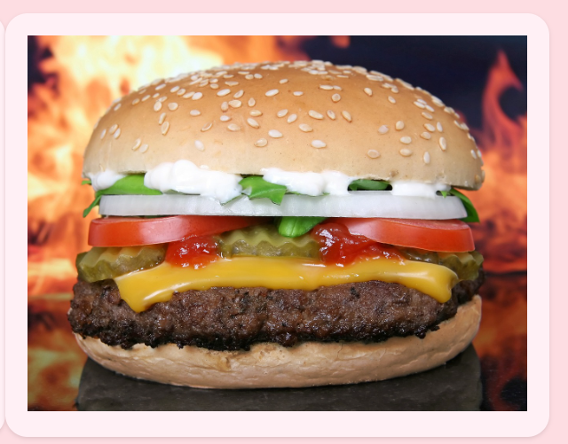
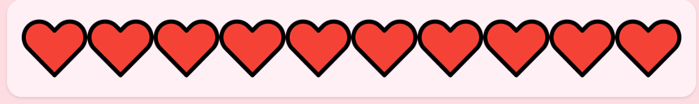
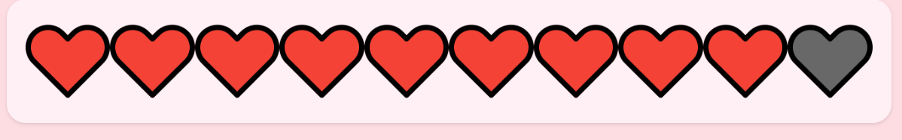
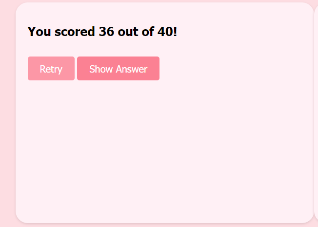
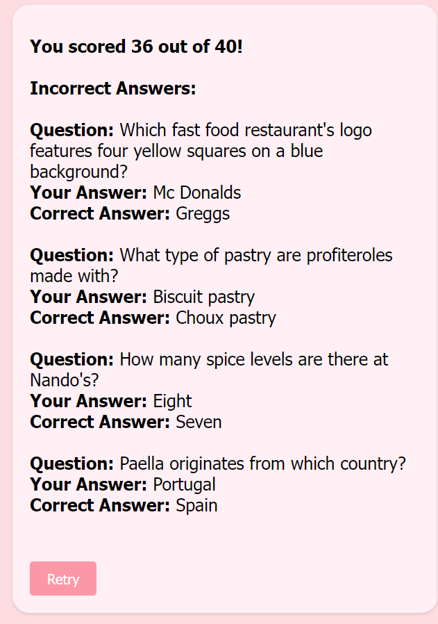

# Foody Quiz

Quizzes were always a fun way to learn facts about certain topics and show them off to friends.
These can be played at parties or alone.

## Features

### The Homepage has these features implemented:

+ The Question-Container

-This is a box where the question is written.
-The quiz is set up with multiple-choice answers.
-These answers have a shuffle function, so the sequence in which they are shown change with every refreshing of the page.
-The number on the top left shows at what question the player is currently on and how many questions are left.
-The number on the top right shows the current score of right anwers questions.
-On the bottom of the container is a submit button.

+ The Image-Container

-This is a box where an image is shown.
-Every image is in some way linked to the question.
-The image changes with every question.

+ The Healthbar

-On the bottom of the page is a healthbar.
-Every player has a total of 10 lives.
-Lives are displayed as hearts.
-When 10 questions are answered wrong, the player gets the score and a chance to retry or look at the right answers of those questions.
-If a live is lost, the heart icon turns grey, as shown in this image:

+ The Score-Container

-On the end of the quiz, the result is shown.
-The left side is a retry button, that will bring the player back to the start of the quiz.
-On the right side is a "Show Answer" button, that will show the player the right answer of every question that got answered wrong.

+ The Show Answer-Container

-After clicking the "Show Answer" button, this container openes.
-On the top is the score shown.
-Under that every incorrect Question is shown, including the answer that was choosen and the correct answer.
-On the bottom is the retry button, which will bring the player back to the start of the quiz.

## Testing

+ Tested the Webpages HTML multiple times with the offical validator.
+ No bugs or issues found

+ Tested the Webpages CSS multiple times with the offical validator.
+ Bugs found: 

+ Tested the Webpages JavaScript multiple times with the offical validator.
+ Bugs found: 

## Validator Testing

+ HTML

+ CSS

+ JavaScript

## Unfixed Bugs

## Deployment

## Credits

### Content

Questions and answers: <https://www.cosmopolitan.com/uk/worklife/a38869041/food-quiz/>
Tutorial for a general Quiz-Page: <https://www.codewithfaraz.com/content/161/build-a-quiz-application-with-html-css-and-javascript-step-by-step-guide>

### Media

Images for every question: <https://pixabay.com/>
Icons for healthbar and favicon: <https://iconscout.com/icons/tabs>
